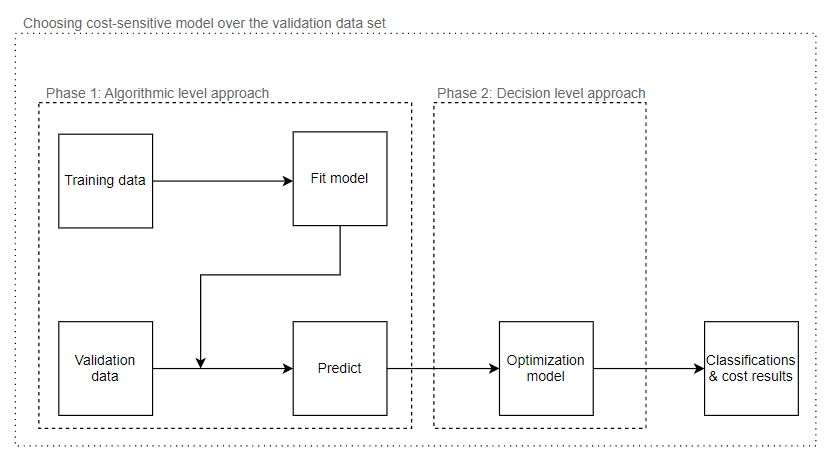

#  A Hybrid Cost-Sensitive Machine Learning and Optimization Models

#### We propose a comprehensive analytic framework for scenarios that, in addition to including multi-class classification problems with misclassification costs, also have constraints on the number of classified samples of classes due to resource limitations.

## Data
We applied our framework on a public available data set obtained from the Osteoarthritis Initiative (OAI). 
The dataset made available after a prepossessing stage at [KneeXrayData](https://data.mendeley.com/datasets/56rmx5bjcr/1).

## Thesis project
This project was created as part of my MSc degree, Supervised by Dr. Gonen Singer and Dr.Ilan Cohen.

